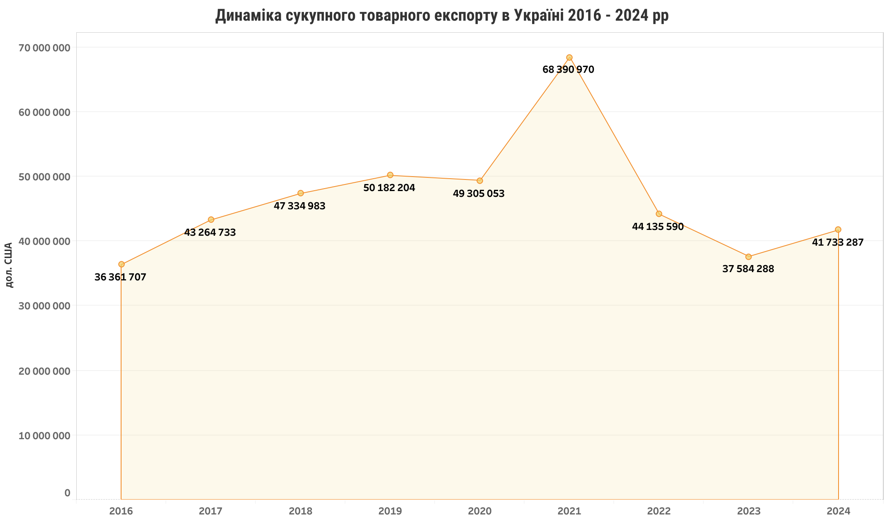
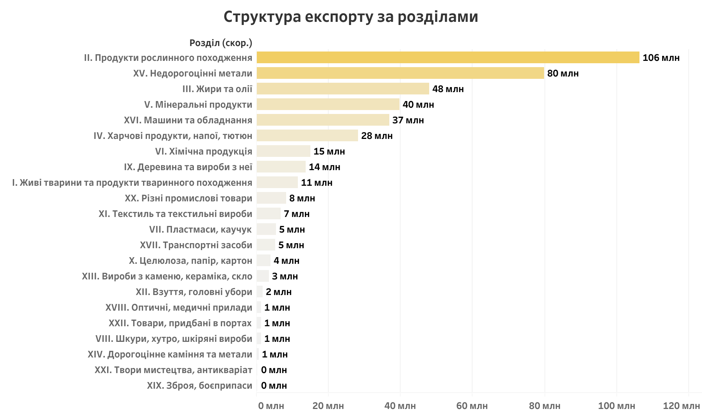
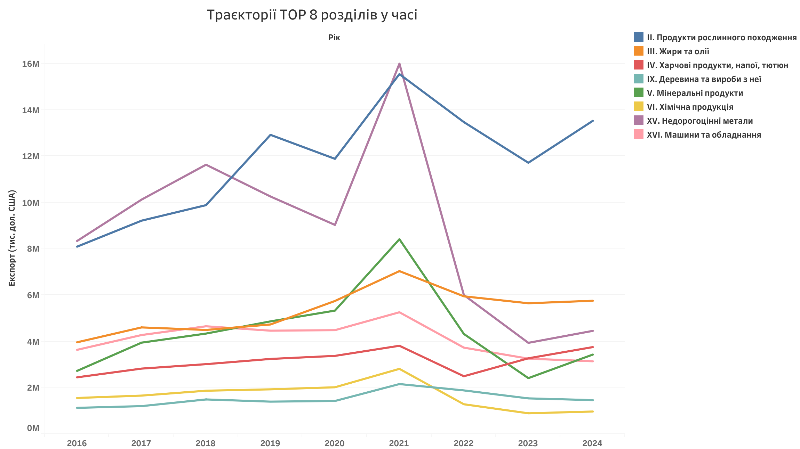
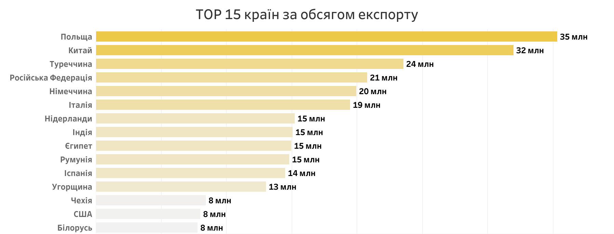
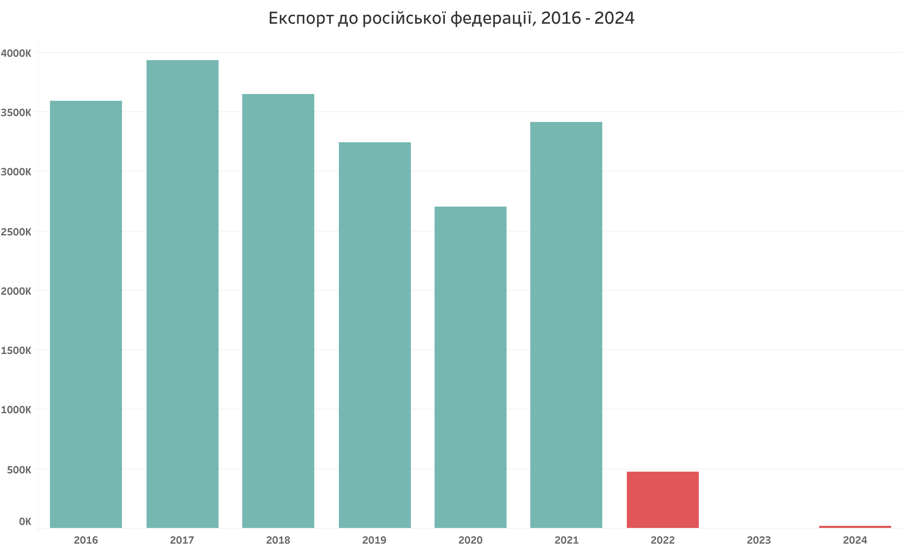

# Аналіз товарного експорту України 2016-2024 
Офіційні дані Держстату про експорт товарів щороку з 2016 по 2024 рік. 
https://stat.gov.ua/uk/explorer

Дашборд https://public.tableau.com/app/profile/olga.bosyak/viz/2016-2024_17875246473560/Dashboard1#2
## Мета аналізу

Метою аналізу є дослідження динаміки експорту України,
його географічної та товарної структури у 2016–2024 роках.

## Методологія

Вихідний масив містив понад 270 колонок з розрізами за роками, місяцями та видами показників. Для аналізу відібрано: річний вартісний показник (дол. США), розріз "Товари за країнами" на рівні товарних груп (98 позицій), роки 2016–2024. Товарні групи згруповано у 22 розділи УКТЗЕД за стандартними діапазонами кодів (перевірено на збіжність з офіційними підсумками, розбіжність <1%).

| Параметр | Значення |
|---|---|
| Період | 2016–2024 (9 років) |
| Кількість країн-партнерів | 228 |
| Кількість товарних розділів | 22 |
| Рядків очищеного датасету | 32 031 |
| Сумарний обсяг за період | 418,3 млрд дол. США |

## 1. Динаміка сукупного експорту
      

 
 Мал.1. Динаміка сукупного товарного експорту України, 2016–2024
 

 | Показник | Значення |
|---|---|
| Середнє | 46 477 млн $ |
| Медіана | 44 136 млн $ |
| Стандартне відхилення | 9 503 млн $ |
| Коефіцієнт варіації | 20,4% |
| Мінімум | 36 362 млн $ (2016) |
| Максимум | 68 391 млн $ (2021) |

Даний графік  показує загальний обсяг експорту товарів за кордон.
Зростання по роках було нерівномірним, стрибками. З 2016 по 2019 рік продажі поступово зростали (загалом на 38%). У 2020 — невеликий спад через пандемію (−1,7%, майже непомітно). У 2021 — різкий стрибок вгору (+38,7%): після пандемії світова торгівля відновилась, а ціни на сировину злетіли. У 2022 — обвал (−35,5%) через повномасштабне вторгнення. У 2023–2024 — повільне відновлення.

## 2. Структура за розділами УКТЗЕД

Мал. 2. Структура експорту за розділами УКТЗЕД, сума 2016–2024
| # | Розділ | млрд $ | Частка |
|---|---|---|---|
| 1 | Продукти рослинного походження | 106,3 | 25,4% |
| 2 | Недорогоцінні метали | 79,8 | 19,1% |
| 3 | Жири та олії | 47,9 | 11,5% |
| 4 | Мінеральні продукти | 39,8 | 9,5% |
| 5 | Машини та обладнання | 36,9 | 8,8% |

Три найбільші категорії товарів дають разом майже 56% усього заробітку від експорту, а п'ять найбільших — аж 74%. Тобто левова частка грошей тримається лише на кількох товарах.
Є спеціальний показник, який вимірює, наскільки економіка "залежить від небагатьох джерел" (індекс Херфіндаля–Хіршмана) — за ним ситуація України зараз на межі "помірної" залежності: не критично, але й не найкраще.
Простіше кажучи: більше половини валютної виручки — це продаж зерна, олії та металу, тобто переважно сировини або продукції з мінімальною обробкою. А ось техніки й обладнання — товарів, які зазвичай приносять найбільший прибуток, бо це готовий, складніший продукт — продаємо мало: лише кожен 11-й долар (8,8%).

Мал.3. Як змінювались продажі найбільших товарних категорій по роках

Цей графік показує: майже всі великі категорії товарів — то зростають, то падають одночасно, в один і той самий рік. Це означає, що на них впливає щось спільне (загальна ситуація в економіці й війна), а не проблеми в кожній окремій галузі.

## 3. Географічний аналіз
 
Мал.4. 15 країн, які купують найбільше українських товарів

  Тут гарна новина: Україна продає товари у 228 різних країн світу, і жодна з них не купує більше 9% від усього експорту. Це означає, що ми не залежимо критично від якогось одного покупця — якщо один ринок закриється, є багато інших.
  Найбільші покупці: Польща, Китай, Туреччина, Німеччина, Італія.
  На топ-5 країн разом припадає менше третини всього експорту — решта розподілена між іншими 220+ країнами.

Рис. 4. Експорт до Російської Федерації, 2016–2024

Окрема важлива історія — торгівля з рф. До 2022 року Росія була одним з важливих покупців (входила у топ-5). Після повномасштабного вторгнення торгівля впала практично до нуля вже в перший рік і залишається на нулі й досі. Це показує, що розрив економічних зв'язків був повним і остаточним, а не тимчасовим.

## 4. Висновки
**Добре:**
- Україна має багато торговельних партнерів. У 2024 році їх було 228, а найбільша країна-партнер займала менше 9% експорту. Це добре, тому що залежність від однієї країни невисока.
- Торгівля з Росією практично припинилася. Її частка зменшилася приблизно з 5% до майже 0% за три роки. Це показує, що Україна змогла поступово переорієнтувати торгівлю на інші ринки.
- Основні товари експорту залишаються важливими для економіки. Агропродукція та метали мають стабільний попит на світовому ринку й забезпечують значну частину валютних надходжень.
- Експорт почав відновлюватися. У 2024 році його обсяг зріс приблизно на 11% порівняно з 2023 роком. Це може свідчити про адаптацію логістики та використання нових маршрутів, зокрема морського коридору.

**Погано:**
- Україна сильно залежить від кількох основних товарних груп. Три найбільші групи дають 55,9% експорту. Водночас частка машин та іншої продукції з більшою доданою вартістю становить лише 8,8%. Це означає, що український експорт значною мірою залежить від сировини.
Експорт ще не повернувся до рівня 2021 року. У 2024 році він становив 41,7 млрд дол., що приблизно на 39% менше, ніж у 2021 році, коли було 68,4 млрд дол.
- Деякі товарні групи дуже нестабільні. Наприклад, зброя, твори мистецтва та дорогоцінне каміння можуть показувати дуже різкі зміни. Через це складніше прогнозувати їхній вплив на загальний експорт.
- Є підозрілі дані. Наприклад, експорт «творів мистецтва» за один рік зріс у 108 разів. Такі цифри потрібно перевірити, тому що вони можуть бути помилкою або одноразовою операцією.

**Що потрібно покращувати:**
Спочатку перевірити аномальні дані. Особливо показники щодо творів мистецтва та зброї. Без цього частина подальшого аналізу може бути неточною.
Зменшити залежність від кількох товарів. Варто розвивати переробну промисловість і збільшувати експорт готової продукції, а не лише сировини.
Збільшити загальний обсяг експорту. Для цього потрібно усувати проблеми з логістикою, зокрема збільшувати пропускну здатність портів, залізниці та кордонів.
Окремо працювати з нестабільними секторами. Для товарних груп із дуже великими коливаннями потрібно визначити причини цих змін і розробити способи зменшення ризиків.

## 5. Рекомендації

**5.1. Для дослідника, інвестора або підприємця**
Перед прийняттям важливих рішень потрібно перевіряти незвичайні показники за першоджерелом Держстату.
Для бізнесу можна звернути увагу на більш стабільні товарні групи, зокрема текстиль, харчову продукцію та машини.
Варто використовувати дані не лише за країнами, а й за окремими товарами, щоб знаходити нові перспективні ніші.
Якщо потрібні швидкі рішення, краще аналізувати квартальні дані, а не тільки річні. Річні показники можуть приховувати сезонні зміни та короткострокові проблеми.

**5.2. Для організацій, бізнес-асоціацій та аналітичних центрів**
Перевірити аномальні дані разом із Держстатом і пояснити, чому вони виникли.
Розробити плани для зменшення залежності від аграрної продукції, металів та олій. Більше уваги варто приділяти переробці продукції в Україні.
Створити регулярний щоквартальний дашборд, який автоматично оновлюватиметься та показуватиме зміни в експорті.
Використовувати кореляційний аналіз обережно: якщо два товари зростають одночасно, це ще не означає, що один безпосередньо впливає на інший.

**5.3. Для державних органів**
Держстату варто перевірити незвичайний стрибок експорту творів мистецтва у 2023 році та появу окремих товарних категорій.
Мінекономіки варто більше підтримувати виробництво продукції з високою доданою вартістю, щоб зменшити залежність від сировини.
Мінекономіки та торговельним представництвам потрібно працювати над збільшенням експорту та усуненням проблем із портами, залізницею та кордонами.
Для дуже нестабільних товарних груп можна розглянути додаткове страхування та інші способи зменшення ризиків для експортерів.
Було б корисно публікувати квартальні дані у зручному для аналізу форматі, де можна одразу побачити, який товар і до якої країни експортується.

## Основні результати

У 2024 році обсяг експорту України становив 41,7 млрд дол.
Це приблизно на 39% менше, ніж у 2021 році.

Географічна структура експорту є достатньо диверсифікованою:
у 2024 році Україна мала 228 країн-партнерів.
